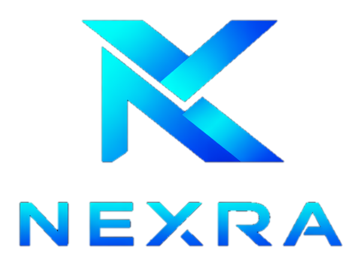

<div align="center">
  

  # Nexra Panel

  **A multi-panel admin manager for Marzban, 3x-ui, Tx-ui and Guard — with role-based access, a unified dashboard, custom login branding, and automatic Telegram backups.**

  <p align="center">
    <a href="https://t.me/NexraTunnel" target="_blank">
      
    </a>
    
    
  </p>
</div>

---

## 🎯 Overview

Nexra Panel is a self-hosted dashboard for managing the **admins** of your VPN panels from one place. Create sub-admins with traffic and expiry limits, monitor usage, and manage users across multiple panels with role-based access (**SuperAdmin** / **Admin**).

---

## ⛓️ Supported panels

- [x] **Marzban**
- [x] **3x-ui**
- [x] **Tx-ui**
- [x] **Guard**
- [ ] **S-ui**

---

## ✨ Features

| Feature | Description |
|---------|-------------|
| 🔐 **Role-based access** | SuperAdmin & Admin roles with granular permissions |
| 📊 **Unified dashboard** | Monitor all your panels from a single interface |
| 👥 **Admin & user management** | Create, edit and limit admins/users across panels |
| 📈 **Traffic & quota** | Per-admin traffic budgets, with automatic return-on-delete |
| 🎨 **Custom branding** | Set the login page **title and logo** right from Settings |
| 💾 **Telegram backups** | Auto-send the database to a Telegram chat on a schedule |
| 📱 **PWA** | Install on a phone home screen with a custom name & icon |
| 🌙 **Dark / Light mode** | Theme-aware UI |
| 🐳 **Docker ready** | One-command deployment |

---

## ⚡ Quick start

```bash
git clone https://github.com/MHBehzadian/nexra-panel.git
cd nexra-panel
cp .env.example .env        # set ADMIN_USERNAME / ADMIN_PASSWORD / JWT_SECRET_KEY / PORT
docker compose up -d --build
```

Then open:

```
http://<your-server>:<PORT>/<URLPATH>/login
```

(default `URLPATH` is `dashboard`).

> **HTTPS:** put Nexra Panel behind a reverse proxy (Nginx/Caddy) pointed at the panel port, or set `SSL_KEYFILE` / `SSL_CERTFILE` in `.env`.

---

## ⚙️ Settings

From **Settings** (SuperAdmin) you can:

- **Login branding** — change the login page **title** and **upload a logo**.
- **Telegram backup** — enable automatic backups and set the **bot token**, **numeric chat id** and **interval (hours)**; a **Send test backup now** button lets you verify it instantly.

The backup is the panel database (`walpanel.db`), sent as a document to your Telegram chat.

---

## 📣 Telegram

Channel & updates: **[@NexraTunnel](https://t.me/NexraTunnel)**

---

## 🤝 Contributing

Issues and pull requests are welcome.

---

## 📄 Credits & license

Nexra Panel is built on top of [whale-panel](https://github.com/primeZdev/whale-panel) by primeZdev, and is released under the **MIT License** (see [LICENSE](./LICENSE)). The original copyright notice is retained as required by the license.
